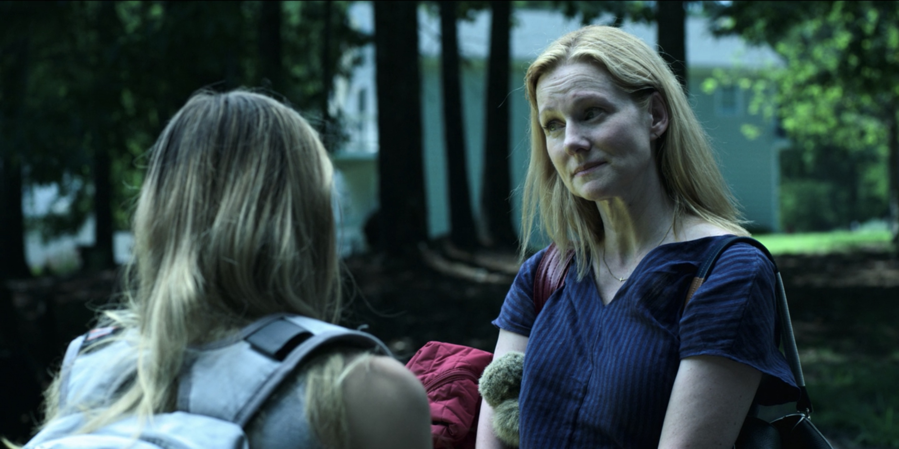

I believe that the best contemporary crime TV shows are naturally revisionist. These shows toy with the genre expectations deeply woven into our collective unconscious. The perfect embodiment of this idea is Pulp Fiction (1994), a movie that brought into question the events after a murder gone wrong. If you stay after the cool violence, the grandiose becomes the silly and messy, and movies hadn’t done that before.

But not every crime TV show has to defy genre expectations. CSI is a guilty pleasure show for me, but it always ends neatly and doesn’t ever push the genre too hard. It seems the ones that stick with you, the movies and shows that really change the game, question our assumptions. So it’s no coincidence that the greatest crime show ever made, Breaking Bad, starts just like one of the chapters in Pulp Fiction — cleaning up a murder gone wrong. The show focused on aspects of the criminal underworld largely ignored in other shows, and throughout the seasons, Breaking Bad dismantled the assumed rules of crime TV.

Breaking Bad did away with the common trope of the bad cop using questionable interrogation tactics to get what they want, like in The Shield and 24. When people in custody say they won’t talk without their lawyer, they mean it. I guess earlier writers assumed audiences weren’t very interested in the lawyer mumbo jumbo in a crime show, but they were wrong. Who would have thought a show following due process could remain so engaging?

Breaking Bad even introduced a previously ignored idea in crime drama — money laundering. That was a largely unheard of criminal topic. Remember in Goodfellas (1990) when they do one of the biggest heist in American history? There’s that one scene where Johnny starts killing people off because they’re spending the money too soon. The movie glosses over the bigger issue — it doesn’t matter how long they wait, there’s no easy way to spend dirty money.

In The Shield, they also get more money than they can spend, but it turns into this subplot about how some of the money is marked by the Feds. The concept of “Money laundering” is barely even mentioned. These prior shows and movies make up a simple “not boring” consequence to spending the money.

And that’s where Breaking Bad does it right. Like the aftermath of violence, like the realistic use of lawyers, and like the money laundering, Breaking Bad broke the rules by focusing on the parts of crime that were previously ignored, creating something entirely fresh.

But Breaking Bad doesn’t go that far with money laundering. There’s an explanation of the concept and the recurring issue that they have more money than they could ever launder. But hey, that’s more than anybody else had done.

And that brings us to Ozark, a show that takes genre revisionism to the next level. Like Breaking Bad did to Pulp Fiction, Ozark has a similar relationship with Breaking Bad: Ozark takes the rules established in one era of TV crime and questions them.

Crime shows almost always revolve around money — who has it, who wants it, and what they’re willing to do to get it. We are used to the cold-blooded murders, the cops fast on their tail, and the moral ambiguity of it all. But like Breaking Bad, Ozark has a fun time showing the legal side of crime, where characters operate in plain sight and law enforcement can’t do anything to stop them. After all, when Martin Byrde withdraws eight million dollars from his bank accounts, he follows the law to a T. And it’s funny.

There’s a certain delight to seeing him get away with millions of dollars and the cops can’t touch him. It’s a new way to see a side of crime that earlier writers may have thought was too boring. When some hoodlums steal his millions, he doesn’t have to kill them to get it back like something out of The Sopranos. He walks up to their hideout and reminds them they would implode with that much stolen money. And they give it all back voluntarily, minus a measly $10,000.

There are several new aspects of crime added to Ozark that feel fun and fresh. My favorite one just might be the fact that “the secret” doesn’t matter. In most other crime shows (Breaking Bad included), some major climaxes revolve around if other people find out the secret. Skyler hears a voicemail left by Jessie, oh no! Hank is on the force! What if he found out?

In Ozark, nobody really cares.

“Your father’s laundering money for a drug cartel. I shit you not.” — that’s at the end the second episode!

Think of all the shows where figuring out the big secret is a thing. One characters knows something the rest don’t. In Ozark, Marty reveals his secret to his employees, his whole family, basically all the supporting cast. And that’s interesting, because the show creates suspense even through symmetric information — the premise of the show isn’t a secret to anybody.

The show does plenty of genre-bending. It starts with the affair — the marriage is already completely broken. None of this “I fucked Ted” stuff. It’s fun when Marty casually brings up his wife’s affair offhand, since he’s clearly more worried about other things.

I’m not saying this show is better than other shows because it goes the next step. What I am saying is, it does fit nicely into the narrative that the best crime shows continuously defy expectations set by the previous “generation” or shows. Before starting a show with a normal family in the thick of crime like Ozark, it’s only natural that you’d show families who start off innocent and go bad, so that’s Weeds and Breaking Bad.

But it’s certainly something to think about. Great TV is all about innovation, and there’s some things I didn’t love about Ozark, but it’s an example of revisionism done right. They have decades of dirty, established crime TV at their fingertips. In Season 2, I look forward to seeing how they launder it.
